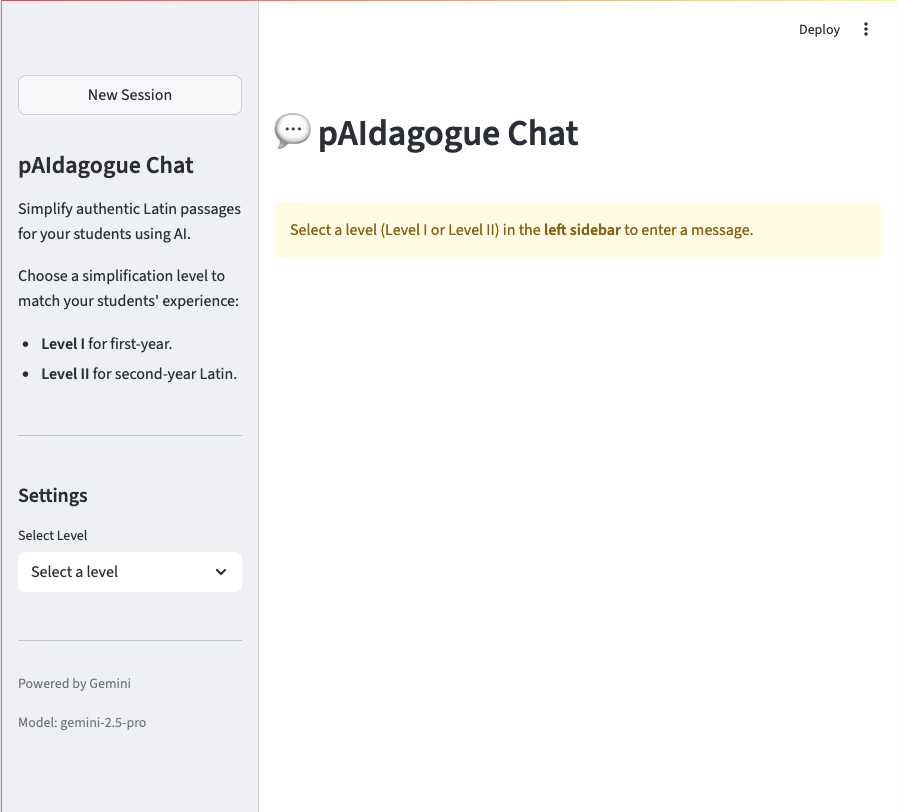

# Digital Latin

Digital Latin is a web-based Latin language assistant to support instructors with Latin passage simplifications to use as teaching tools. 

Features a Streamlit frontend and a modular backend that integrates with the Gemini large language model. Supports multi-turn chat and session management with data stored in either SQLite or PostgreSQL. Session data can be exported in YAML or JSONL formats for reproducibility and debugging.

The project is containerized for easy deployment and includes tools for session migration, prompt templating, and database management.



<details open>
<summary><strong>Key Features</strong></summary>

- **Model Selection:** Choose from a list of allowed models.
- **System Prompts:** Set predefined prompts for Level I and Level II Latin translations.
- **Multi-Turn Interaction:** Chat with the Gemini large language model and view conversation history.
- **Session Management:** Save and load user sessions with SQLite or PostgreSQL.
- **Data Export:** Export sessions to Markdown, YAML, or JSONL for analysis.
- **Containerized:** Easy setup and deployment with Docker and Docker Compose.

</details>

<details>
<summary><strong>Architecture</strong></summary>

The following diagram illustrates the high-level architecture:

```mermaid
graph TD
    subgraph Frontend
        A[Streamlit UI]
    end
    subgraph Backend
        B[Gemini Pipeline]
        C[Session DB Interface]
        D[Prompt Templates (Jinja2)]
    end
    subgraph Storage
        E[(PostgreSQL/SQLite)]
        F[Session Files (YAML/JSONL)]
    end

    A -- User Input/Chat --> B
    A -- Session Management --> C
    C -- Save/Load --> E
    C -- Export/Import --> F
    A -- Prompt Selection --> D
    D -- Rendered Prompt --> B
    B -- Response --> A
```

</details>

<details>
<summary><strong>Local Development</strong></summary>

<details open>
  <summary><strong>Quick Start</strong></summary>

  ### Prerequisites

  - **Docker & Docker Compose:** For running in a containerized environment.
  - **Python 3.12+** (for local development).
  - **Git:** For cloning the repository.

  **Option 1: Docker Compose (Recommended)**

  ```bash
  docker-compose -f docker-compose.local.yml up --build
  # access: http://localhost:8502
  ```

  **Option 2: Local Python Environment**

  ```bash
  git clone https://github.com/your-org/digital-latin.git
  cd digital-latin/app

  python3 -m venv .venv
  source .venv/bin/activate

  pip install -r requirements.txt

  streamlit run src/core/streamlit_ui_chatapi.py --server.port 8502
  # access: http://localhost:8502
  ```

</details>

<details>
<summary><strong>Configuration</strong></summary>

- Copy example env:

    ```bash
    cp .env.example .env
    ```

- Edit the .env file with your environment variables (`DB_HOST`, etc).

  Note: Files written by the app (like debug JSON) are stored in the local filesystem or container.

</details>

<details>
<summary><strong>Database Management & Inspection</strong></summary>

- Access the running Postgres container:

    ```bash
    docker-compose exec postgres bash
    psql -U postgres -d sessions
    ```

- List tables: `\dt`
- Select all sessions: `SELECT * FROM sessions;`
- Exit psql: `\q`
- Exit container: `exit`


- If you change the Postgres image version in docker-compose:

    ```bash
    # Back up data before this step!

    # Removes the docker volume that retains data between container deployments
    docker-compose -f docker-compose.local.yml down -v

    docker-compose -f docker-compose.local.yaml up --build
    ```

</details>

<details>
<summary><strong>Testing</strong></summary>

Run tests from the root of `app`:

```bash
pytest
# or
python -m unittest discover
```

</details>

<details>
<summary><strong>Exposing Your App with ngrok</strong></summary>

- [ngrok download](https://ngrok.com/download)
- Run your Streamlit app on port 8502
- In a new terminal:

    ```bash
    ngrok http 8502
    ```
- Share the public forwarding URL from ngrok

</details>

<details>
<summary><strong>Project Structure</strong></summary>

```
app/
├── data/
│   ├── sessions.db
│   └── sessions/
│       ├── example_session.yaml
│       └── postgres_debug_session_write.jsonl
├── docs/
├── prompts/
│   ├── level1_system_prompt.jinja2
│   ├── level2_system_prompt.jinja2
│   └── u1.0_virgil_user.jinja2
└── src/
    ├── core/
    │   ├── gemini_pipeline.py
    │   ├── session_db_postgres.py
    │   ├── session_db_sqlite.py
    │   └── streamlit_ui_chatapi.py
    └── tools/
        ├── export_sessions_to_markdown.py
        ├── fix_session_data.py
        ├── load_dummy_sessions.py
        └── migrate_sessions_schema.py

.env.example
Dockerfile
entrypoint.sh
requirements.txt
README.md
docker-compose.yml
changelog.md
streamlit-ui.code-workspace
```

</details>

<details>
<summary><strong>Troubleshooting</strong></summary>

- Ensure dependencies are installed (`pip install -r requirements.txt`).
- Verify `.env` exists and is configured.
- Check terminal output for error messages.
- `entrypoint.sh` is made executable during Docker build; no need to `chmod` manually.

</details>

</details>

<details>
<summary><strong>Deployment</strong></summary>

**AWS ECS Deployment (Terraform-based):**
- ECR registry auto-created
- Automated Docker image builds (CodeBuild).
- DNS, load balancer, standardized Splunk logging.

For details, see your devops mono-repo (e.g., `atg-ops-appserver`).

</details>

<details>
<summary><strong>Further Reading & Resources</strong></summary>

- Streamlit [Official Documentation](https://docs.streamlit.io)
    - [Architecture Overview](https://docs.streamlit.io/architecture)
    - [Custom Components](https://docs.streamlit.io/library/components)
    - [Create a Component](https://docs.streamlit.io/library/components/create)
- Community
    - [Components Gallery](https://streamlit.io/gallery)
    - [Streamlit in 5 Minutes](https://www.youtube.com/watch?v=VqgUkExPvLY)
    - [5 Things I Wish I Knew Before Learning Streamlit](https://www.youtube.com/watch?v=qTiF0Mdq05w)
    - [How to Control the Layout in Streamlit](https://www.youtube.com/watch?v=tPWR-y06D3E)

</details>

<details>
<summary><strong>Contributing</strong></summary>

1. Fork the repository
2. Create a feature branch: `git checkout -b new-feature`
3. Make your changes and commit: `git commit -am 'Add new feature'`
4. Push to the branch: `git push origin new-feature`
5. Submit a pull request

</details>

---

## License

Forthcoming

## User Tips (Quick Reference)

<details>
<summary><strong>User Guide (click to expand)</strong></summary>

- Start a new session for each passage to avoid mixing contexts.
- Once you select a level, it is locked for the session. To change levels, start a new session.
- If you don’t see the sidebar, hover in the upper left corner and click the double arrows (≡) to open it.
- On mobile, the sidebar may be hidden by default—use the double arrows to open it.
- Wait for the “thinking” icon in the upper right to disappear before your next action.
- Streamlit is less reactive than some web apps. Use slow, intentional clicks and wait for the app to update before clicking again.

See [user_guide.md](./user_guide.md) for full instructions.

</details>
