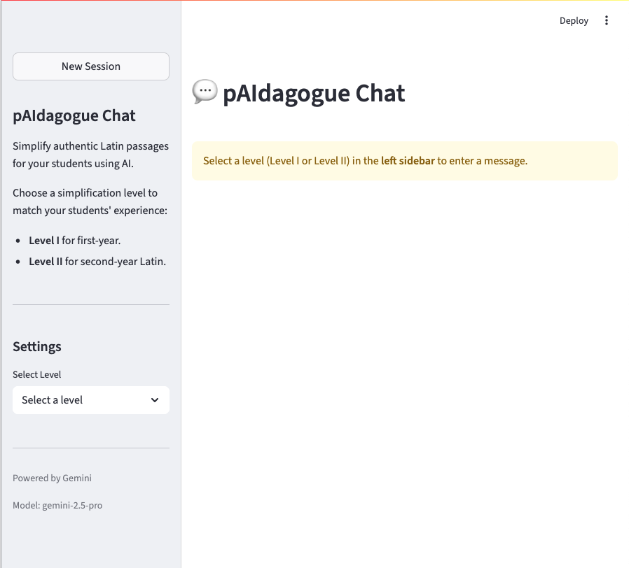

# Digital Latin

A web-based Latin passage simplification assistant for instructors. Uses AI to help Latin teachers simplify authentic classical texts for students at different proficiency levels.

Dev URL: https://digital-latin.tlt.dev.harvard.edu
Prod URL: https://digital-latin.tlt.harvard.edu



## Key Features

- **Level-based Simplification**: Level 1 (first-year) and Level 2 (second-year) Latin
- **Interactive Chat Interface**: Multi-turn conversations with the AI assistant
- **Session Data Persisted**: Session conversations persisted with a PostgreSQL Database
- **Containerized Architecture**: Frontend (Streamlit) + Backend (Promptflow - Flow API) + Database

## Quick Start

### Prerequisites
- Git: For cloning the repository
- Docker & Docker Compose: For running the containerized environment locally
- Python 3.12: For development

### Running the Application

**Important**: The frontend and backend services are interdependent and must run together via Docker Compose.

1. **Clone and setup**:
   ```bash
   git clone <repository-url>
   cd digital-latin
   cp .env.example .env
   ```

2. **Configure environment**:
   Copy `.env.example` to `.env` and edit `.env` with your API keys and settings (see Configuration section below)

3. **Start all services**:
   ```bash
   docker-compose -f docker-compose.local.yml up --build
   ```

4. **Access the app**: http://localhost:8502

The application consists of three services that start together:
- **Frontend** (Streamlit UI): Port 8502
- **Backend** (Flow API): Port 8080  
- **Database** (PostgreSQL): Port 5432

## Usage

1. Select a simplification level (Level 1 or Level 2) in the sidebar
2. Enter your Latin passage in the chat
3. Receive a simplified version with detailed breakdown
4. Sessions are saved automatically to PostgreSQL

For detailed usage instructions, see [User Guide](user_guide.md).

## Architecture

```
┌─────────────────┐    ┌─────────────────┐    ┌─────────────────┐
│  Streamlit UI   │───▶│   Flow API      │───▶│   Gemini API    │
│  (Frontend)     │    │   (Backend)     │    │   (External)    │
│  Port 8502      │    │   Port 8080     │    │                 │
└─────────────────┘    └─────────────────┘    └─────────────────┘
         │                                    
         ▼                                    
┌─────────────────┐                          
│   PostgreSQL    │                          
│   (Database)    │                          
│   Port 5432     │                          
└─────────────────┘                          
```

## Project Structure

```
digital-latin/
├── frontend/                    # Streamlit UI service
│   ├── app/src/core/           # Application code
│   │   ├── streamlit_ui_chatapi.py
│   │   ├── flow_api_endpoint.py
│   │   └── session_db_postgres.py
│   ├── Dockerfile              # Frontend container
│   └── requirements.txt        # Python dependencies
├── backend/                     # Flow API service
│   ├── digital_latin_flows/    # AI processing flows
│   ├── _connections_manager_/  # API connections
│   ├── Dockerfile              # Backend container
│   └── start.sh                # Service startup script
├── .env.example                # Environment template
├── docker-compose.local.yml    # Local development
└── user_guide.md               # End-user documentation
```

## Configuration

Copy `.env.example` to `.env` and configure these required sections:

### Frontend & Database
- **GOOGLE_API_KEY**: Your Gemini API key
- **GOOGLE_ALLOWED_MODELS**: Comma-separated list of allowed models
- **DB_USER/DB_PASSWORD**: PostgreSQL credentials  
- **AUTH_USER_1/AUTH_PASSWORD_1**: App authentication (up to 3 users supported)

### Backend Service
- **GEMINI_API_KEY**: Backend service API key (may differ from frontend)
- **AWS_AI_WORKFLOW_CORE_DEV_ID/SECRET**: AWS credentials for backend operations
- **KEYRING_CRYPTFILE_PASSWORD**: Keyring encryption password

### Docker Compose Variables
Due to Docker Compose limitations with variable substitution, all variables must be in the root `.env` file:
- **DB_HOST**: Should be `digital-latin-postgres` (container name)
- **FLOW_API_URL**: Should be `http://digital-latin-flow:8080/score` (container name)

See `.env.example` for all configuration options and detailed explanations.

## Development

<details>
<summary><strong>Service Management</strong></summary>

```bash
# Start all services
docker-compose -f docker-compose.local.yml up --build

# Start in background
docker-compose -f docker-compose.local.yml up -d --build

# View logs for specific service
docker-compose logs digital-latin-streamlit-ui-chatapi
docker-compose logs digital-latin-flow
docker-compose logs digital-latin-postgres

# Follow logs in real-time
docker-compose logs -f

# Rebuild specific service
docker-compose build digital-latin-flow

# Stop all services
docker-compose -f docker-compose.local.yml down

# Stop and remove volumes (clears database)
docker-compose -f docker-compose.local.yml down -v
```
</details>

<details>
<summary><strong>Database Access</strong></summary>


```bash
# Connect to PostgreSQL
docker-compose exec digital-latin-postgres psql -U <username> -d sessions

# Common commands inside psql
\dt                    # List tables
SELECT * FROM sessions; # View all sessions
\q                     # Exit psql
```
</details>

<details>
<summary><strong>API Testing</strong></summary>

```bash
# Test backend flow API directly
curl http://localhost:8080/score \
  -H "Content-Type: application/json" \
  -d '{
    "dynamic_template_variables": {},
    "llm_model_id": "gemini-2.5-pro",
    "system_prompt_id": "S1.3B",
    "chat_history": [
      {
        "role": "user",
        "parts": [{"text": "Simplify this Latin: Gallia est omnis divisa in partes tres"}]
      }
    ]
  }'
```
</details>

<details>
<summary><strong>Troubleshooting</strong></summary>

### Common Issues

**Frontend startup fails**
- Check that `.env` file exists and has all required variables
- Verify authentication credentials are set (AUTH_USER_1, AUTH_PASSWORD_1)
- Check Docker Compose logs: `docker-compose logs digital-latin-streamlit-ui-chatapi`

**Backend connection errors**
- Ensure all three services start together via docker-compose
- Verify FLOW_API_URL points to container name: `http://digital-latin-flow:8080/score`
- Check backend logs: `docker-compose logs digital-latin-flow`

**Database connection fails**
- Verify PostgreSQL container is running: `docker-compose ps`
- Check database credentials match between .env and container
- Ensure DB_HOST is set to container name: `digital-latin-postgres`

**API authentication errors**
- Verify both GOOGLE_API_KEY (frontend) and GEMINI_API_KEY (backend) are set
- Check that API keys have proper permissions for Gemini API
- Confirm GOOGLE_API_BASE_URL and GEMINI_BASE_URL are correct

### Service Dependencies

The application **requires all three services** to function properly:

1. **Frontend** depends on **Backend** (Flow API)
   - Frontend makes HTTP requests to backend for AI processing
   - Backend must be accessible at FLOW_API_URL

2. **Frontend** depends on **Database** (PostgreSQL)
   - Frontend stores/retrieves session data
   - Database must be accessible at DB_HOST:DB_PORT

3. **Backend** depends on **External APIs** (Gemini)
   - Backend makes API calls to Google's Gemini service
   - Requires valid API credentials and network access

### Health Checks
```bash
# Check all services are running
docker-compose ps

# Test frontend accessibility
curl http://localhost:8502

# Test backend API
curl http://localhost:8080/score \
  -H "Content-Type: application/json" \
  -d '{"chat_history": [], "level": "Level 1"}'

# Test database connection
docker-compose exec digital-latin-postgres pg_isready -U <username>
```

### Port Conflicts
If you encounter port conflicts:
- Frontend (8502): Change in docker-compose.yml ports section
- Backend (8080): Change in docker-compose.yml ports section  
- Database (5432): Change in docker-compose.yml ports section
- Update corresponding environment variables (DB_PORT, FLOW_API_URL)
</details>

## Production Deployment

Production deployments use AWS ECS with Terraform automation:
- **ECR Registry**: Docker images automatically built and pushed
- **Load Balancer**: AWS Application Load Balancer with SSL termination
- **DNS**: Route 53 integration for custom domain
- **Logging**: Centralized logging with AWS CloudWatch
- **Monitoring**: Health checks and alerting leveraging sentry, splunk, and logic monitor.
- **Secrets**: Secrets managed via AWS SSM Parameter Store
- **Production URL**: https://digital-latin.tlt.harvard.edu

For deployment details, see your DevOps repository (e.g., `atg-ops-appserver`).

## Support Resources

**[User Guide](user_guide.md)**: End-user instructions and tips
  
**Development Team**: Contact your project maintainers


<details>
<summary><strong>Technical Documentation</strong></summary>

- **Streamlit [Official Documentation](https://docs.streamlit.io)**
  - [Architecture Overview](https://docs.streamlit.io/architecture)
  - [Custom Components](https://docs.streamlit.io/library/components)
  - [Create a Component](https://docs.streamlit.io/library/components/create)
- **Community Resources**
  - [Components Gallery](https://streamlit.io/gallery)
  - [Streamlit in 5 Minutes](https://www.youtube.com/watch?v=VqgUkExPvLY)
  - [5 Things I Wish I Knew Before Learning Streamlit](https://www.youtube.com/watch?v=qTiF0Mdq05w)
  - [How to Control the Layout in Streamlit](https://www.youtube.com/watch?v=tPWR-y06D3E)
- **Promptflow Documentation [Official Documentation](https://microsoft.github.io/promptflow/how-to-guides/deploy-a-flow/index.html)**
  - [Flow Development Lifecycle](https://learn.microsoft.com/en-us/azure/ai-foundry/concepts/prompt-flow#flow-development-lifecycle)
  - [Github Deployment Examples](https://github.com/microsoft/promptflow/blob/main/docs/how-to-guides/deploy-a-flow/deploy-using-docker.md)
  - [Application Design for AI Workloads on Azure](https://learn.microsoft.com/en-us/azure/well-architected/ai/application-design)
</details>
