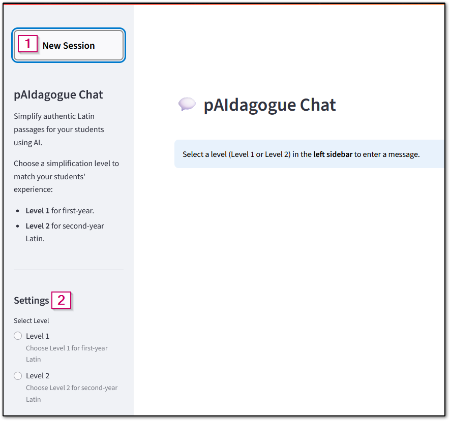
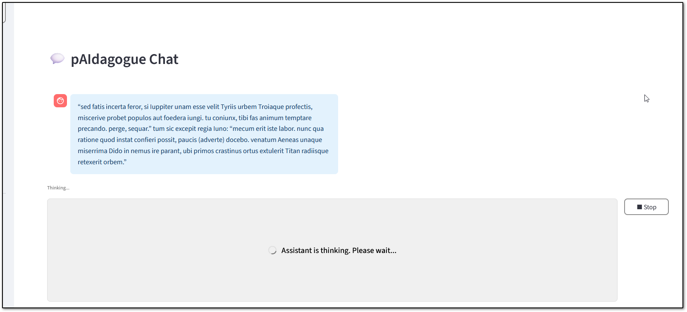

# User Guide: Latin Passage Simplifier (pAIdagogue)

## Overview
This app helps Latin instructors simplify authentic Latin passages for students at different proficiency levels using AI. It provides level-specific simplification, session management, and a user-friendly chat interface.

---

## Getting Started

### 1. Accessing the App
- Open the app in your browser at: [https://digital-latin.tlt.harvard.edu/](https://digital-latin.tlt.harvard.edu/)
- Log in to the app. If you need login credentials, contact [atg@fas.harvard.edu](mailto:atg@fas.havard.edu). 

### 2. Sidebar Navigation
 
*pAIdagogue sidebar*

1. **New Session:**  
  Click "New Session" to start a fresh session. This will clear your chat and allow you to select a new level.
1. **Level Selection:**  
    - Choose either **Level 1** (first-year) or **Level 2** (second-year) for your passage.
    - Until you enter your passage and start the simplification request, you can change the level between level 1 and level 2. 
    - Once you have started the simplification request for a passage, you will need to start a new session if you want to work with a new passage or a new level.
    - It is best to create a new session for each new passage, even if they are the same level, to avoid mixing contexts.

---

## Using the Chat

### 1. Submitting a Passage
- Enter your Latin passage in the chat input area.
- Click the ➤ button to submit the passage. When the passage is successfully submitted, its background will turn blue and you will see an "Assistant is thinking. Please wait..." message on the screen.
  - If the "Assistant is Thinking" screen doesn't come up within 1-2 seconds of clicking the ➤ button, click the button again. 
- The assistant will respond with a simplified version and a breakdown of changes.
  - It may take 1-2 minutes or more for the simplified version to be generated, especially for longer passages.   
  
    
  *pAIdagogue processing a request*

### 2. Follow-up Questions
- After the simplified passage and explanation are generated, you can ask for additional changes by entering them in the message box. 
- Wait for the assistant to answer each question before submitting the next.

### 3. Using the Output
- Once the simplified passage and explanation are generated, you can copy any or all of the text and paste it into another document.
- To copy text, highlight the text to be copied and use Ctrl + C or right click > copy to copy the highlighted text. To paste copied text, use Ctrl + V or right click > paste to paste the last copied content.

**Important:** Sessions are not saved for future access. Once you start a new session or close your browser, the active session will be discarded. Make sure to save any content before closing the window or starting a new session.

---

## Tips for Best Experience
- This app interface is less reactive than some web apps. Use slow, intentional clicks and wait for the app to update before clicking again.
- If the app seems unresponsive, give it a moment to process.
- Always start a new session for a new passage to avoid context overlap.
- Your passages are not saved from one session to the next. Make sure to copy any outputs before starting a new session.

---

## FAQ
**Q: Why can’t I select a new level?**  
A: Once you submit a passage for simplification, the level selection option is locked. Start a new session to change levels.

**Q: Can I use this on my phone?**  
A: Yes, the assistant should work in a mobile browser.

**Q: Why does it take so long to generate the results?**  
A: The assistant processes your submitted passage along with a number of reference materials and instructions, which can take some time (especially for long passages). You will see outputs only once all processing is complete.

**Q: I clicked the submit button, but nothing happened. What do I do?**  
A: Click the submit button again. Sometimes it requires multiple clicks to trigger the submission. 

**Q: How can I tell if my passage submitted successfully?**  
A: The passage you submitted will change to a blue background and you won't be able to edit it anymore. You will also see the "Assistant is thinking. Please wait..." message below your passage.

**Q: I submitted the same passage and level in multiple sessions, and I got different results each time. Why aren't the results consistent?**  
A: Generative AI models are probabilistic, which means they use statistical probability to predict the most appropriate output. As a result, they will not generate exactly the same output every time, even if given identical inputs. The assistant includes some instructions to help it produce more consistent results, but it will not generate exactly the same output every time.

**Q: The simplified passage still uses some words or grammar that are too hard for my selected level. What should I do?**  
A: You can enter additional prompts to ask the assistant to further refine the passage. For example, you could ask it to keep the simpler syntax but use more common vocabulary, or you could ask it to adjust a specific line or sentence further. Since the model is probabilistic (see above), you can also start a new session and enter the same passage and level to see if the new result is better aligned with your needs. 

---

## Support
For help or to report issues, contact [atg@fas.harvard.edu](mailto:atg@fas.havard.edu).
